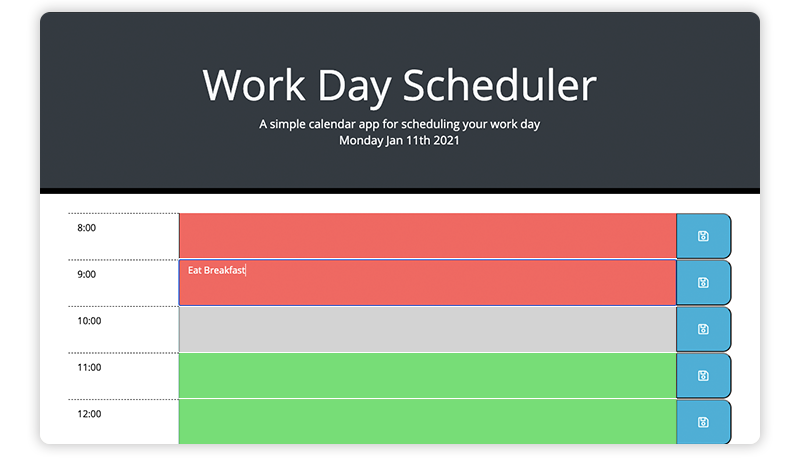

# 005-Daily-Planner
http://github.com - automatic!
[Github Pages](https://rojorevolution.github.io/005_Work_Day_Scheduler/)

## Project Outline

The goal of this project was to create a single day hour calendar, that allows the user to create a to-do list for different hours in the day using local storage and a third party date/time API.

## Features

- Date in the header is pulled from the MomentJS API, and is listed dynamically on page load
- Each row of content includes the hour to the left, the text are and a save button
- On the load the page gets any items in local storage, and render every row of content
- Clicking the center textbox allows user to type
- Clicking the corresponding save button will save the text to local storage
- Finally, the bacground colors are set to correspond to the current time of day. Sections in red are hours in the past, grey is the current hour, and green is the future / upcoming hours

## Side Note

The CSS for this assignment was already included. Initially the colors for past and present were reversed, meaning the current hour was set to red. I felt that was a bit unintuitive from a UX standpoint so I reversed the colors, so all past items are in red.

## Logic

**Variables** include setting all information I was pulling from the MomentJS API into an object, as well as arrays with the hour ranges I needed.

**Functions:** Aiming to improve my coding, I tried to keep my functions as simple and clean and possible, using multiple functions instead of writing one massive one.  Functions written include:
- Getting Items from Local Storage
- Function that changes the background color based on the current time
- Rendering and setting all content on the page 
- Functint the click events
